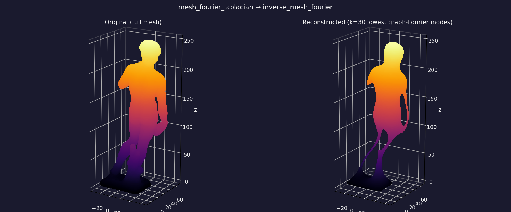

# FourierMesh

Spectral analysis and low-frequency reconstruction for triangle meshes using the **graph Laplacian**.

## Demo

<video src="https://github.com/SentientPlatypus/FourierMesh/raw/master/tests/Artifacts/david_fourier_smoothing.mp4" controls muted width="100%"></video>

*Low-frequency spectral reconstruction of Michelangelo's David, with `k` swept live in the [Blender add-on](blender/) — fewer modes give a smoother, more global shape; more modes restore fine detail. ([Download the clip](tests/Artifacts/david_fourier_smoothing.mp4) if the player doesn't load.)*



## What it does

FourierMesh treats mesh vertices as nodes in a graph (edges from triangle faces), builds the combinatorial graph Laplacian, and uses its eigenvectors as a mesh-specific Fourier basis. Low frequencies are smooth, global shape modes; high frequencies capture fine detail.

Keeping only the first `k` modes reconstructs a smoothed version of the mesh — useful for compression, denoising, and spectral geometry experiments.

## Theory (short)

For adjacency matrix `W` and degree matrix `D`, the combinatorial Laplacian is:

$$L = D - W$$

Eigenpairs satisfy $L u_i = \lambda_i u_i$. Vertex positions `(N, 3)` project onto the basis:

$$\text{coeffs} = U^\top V$$

Reconstruction with the first `k` modes:

$$\hat{V} = U_{:,1:k}\, \text{coeffs}_{1:k,:}$$

## Installation

```bash
git clone https://github.com/SentientPlatypus/FourierMesh.git
cd FourierMesh
python -m pip install -e .
```

Development and examples:

```bash
python -m pip install -e ".[dev]"
```

Optional slicer-friendly mesh repair (`trimesh`):

```bash
python -m pip install -e ".[slicer]"
```

## Quick start

```python
from FourierMesh import load_mesh_stl, reconstruct_mesh

vertices, faces = load_mesh_stl("model.stl")
v_smooth, lambdas = reconstruct_mesh(vertices, faces, k=24)
```

Lower-level API:

```python
from FourierMesh import mesh_fourier_transform, inverse_mesh_fourier

coeffs, U, lambdas = mesh_fourier_transform(vertices, faces, k=24)
v_smooth = inverse_mesh_fourier(coeffs, U, k=24)
```

## David statue example

From the repository root (requires `[dev]` for plotting):

```bash
python examples/mesh_laplacian_david.py --k 30
```

Use `--max-faces 500` for a faster connected submesh. Omit it to run on the full STL.

Outputs:

- Comparison PNG under `tests/Artifacts/Mesh/`
- Reconstructed STL under `tests/models/`

## Blender add-on

A self-contained Blender add-on lives in [`blender/`](blender/) — spectral smoothing and eigenmode visualization directly in the viewport, running on Blender's bundled numpy (no scipy or `pip install` needed).

- **Spectral Smooth** — low-pass reconstruct the active mesh. The eigenbasis is solved once and cached, so dragging `k` in the redo panel (F9) updates live.
- **Visualize Eigenmode** — paint a single Laplacian eigenvector onto the mesh as a color attribute to see individual mesh "frequencies".

Install by zipping the add-on folder and using `Edit > Preferences > Add-ons > Install from Disk`. Full instructions in [`blender/README.md`](blender/README.md).

## Performance

| Mesh size | Solver |
|-----------|--------|
| Small (`N ≤ 2048`, full spectrum) | Dense `numpy.linalg.eigh` |
| Large or partial `k` | Sparse `scipy.sparse.linalg.eigsh` |

Dense full eigendecomposition is `O(N³)`; the library automatically uses sparse low-mode solves for larger inputs.

## Tests

```bash
python -m pytest
```

## Public API

- `load_mesh_stl` / `save_mesh_stl` — STL I/O
- `mesh_laplacian_eigenmodes` — lowest Laplacian eigenpairs
- `mesh_fourier_transform` — project vertex coords onto eigenbasis
- `inverse_mesh_fourier` — reconstruct from coefficients
- `reconstruct_mesh` — one-call low-pass reconstruction

## Dependencies

- Runtime: `numpy`, `scipy`, `numpy-stl`
- Development: `pytest`, `matplotlib`
- Optional: `trimesh` (slicer extras)

## Legacy Dirac branch

Point-cloud Dirac-delta Fourier code lives on the `dirac` branch and is not part of the v0.2 mesh-focused API.
