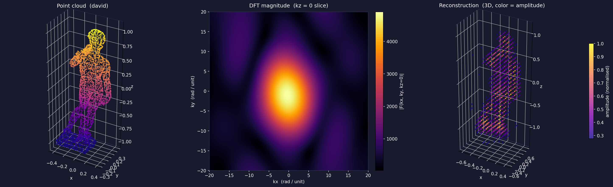
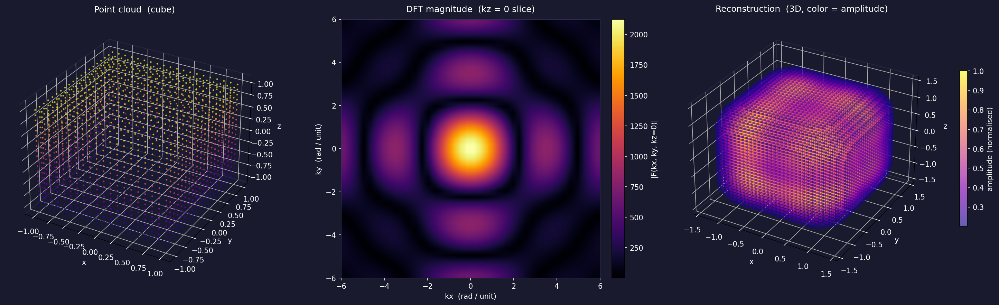
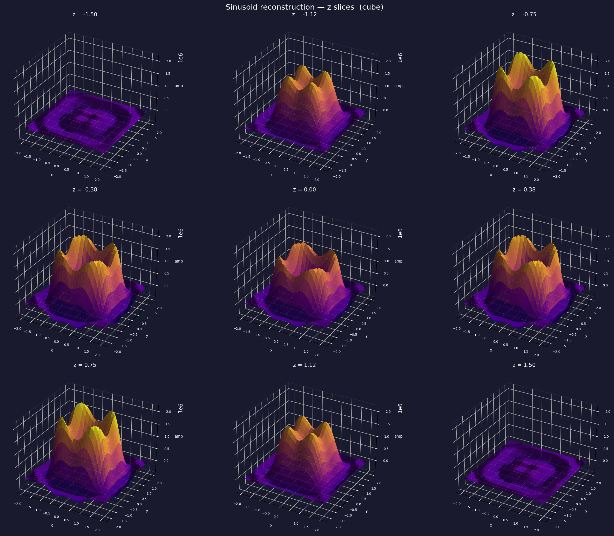

# FourierMesh


A Python library for computing and visualising the continuous Fourier transform of 3D point clouds.

## Theory

### Representing a point cloud as a distribution

A point cloud is not a function in the classical sense, it has no well-defined value between the points. To apply Fourier analysis, we embed it in the space of tempered distributions by modelling it as a sum of Dirac deltas:

$$f(x, y, z) = \sum_{n=1}^{N} \delta(x - x_n)\, \delta(y - y_n)\, \delta(z - z_n)$$

where $(x_n, y_n, z_n)$ are the coordinates of the $n$-th point. This is the unique distribution that is zero everywhere except at the point positions, integrates to $N$ over all of $\mathbb{R}^3$, and preserves the exact geometry of the cloud with no smoothing or interpolation.

### The continuous Fourier transform

The 3D Fourier transform of $f$ is defined as:

$$F(k_x, k_y, k_z) = \int_{-\infty}^{\infty} \int_{-\infty}^{\infty} \int_{-\infty}^{\infty} f(x, y, z)\, e^{-i (k_x x + k_y y + k_z z)}\, dx\, dy\, dz$$

Substituting the Dirac delta representation and using the sifting property — $\int \delta(x - x_n) g(x)\, dx = g(x_n)$ applied independently in $x$, $y$, and $z$ — the triple integral collapses to a sum:

$$F(k_x, k_y, k_z) = \sum_{n=1}^{N} e^{-i (k_x x_n + k_y y_n + k_z z_n)}$$

This is exact — no discretisation, no windowing, no interpolation onto a grid. Each point $(x_n, y_n, z_n)$ contributes a unit-magnitude complex exponential, and $F(k_x, k_y, k_z)$ can be evaluated at any frequency triplet $(k_x, k_y, k_z)$ by direct summation.

### Physical interpretation

Each term in the sum is a unit phasor:

$$e^{-i(k_x x_n + k_y y_n + k_z z_n)} = \cos(k_x x_n + k_y y_n + k_z z_n) - i\sin(k_x x_n + k_y y_n + k_z z_n)$$

This is a point on the unit circle in the complex plane at angle $-(k_x x_n + k_y y_n + k_z z_n)$. The full sum $F(k_x, k_y, k_z)$ is a vector sum of $N$ such phasors.

- If the points are **periodically spaced** along the direction $(k_x, k_y, k_z)$ with period $2\pi / \sqrt{k_x^2 + k_y^2 + k_z^2}$, then all phasors have the same angle and add constructively — $|F(k_x, k_y, k_z)| = N$.
- If the point coordinates projected onto $(k_x, k_y, k_z)$ are uniformly distributed, the phasors point in all directions and cancel — $|F(k_x, k_y, k_z)| \sim \sqrt{N}$.

The magnitude $|F(k_x, k_y, k_z)|$ therefore measures how strongly the point cloud resonates at spatial frequency $(k_x, k_y, k_z)$. The phase $\arg F(k_x, k_y, k_z)$ encodes where along the $x$, $y$, $z$ axes the peaks of that frequency component are located.

### Reconstruction

The inverse Fourier transform recovers the original distribution from its spectrum:

$$f(x, y, z) = \frac{1}{(2\pi)^3} \int_{-\infty}^{\infty} \int_{-\infty}^{\infty} \int_{-\infty}^{\infty} F(k_x, k_y, k_z)\, e^{i(k_x x + k_y y + k_z z)}\, dk_x\, dk_y\, dk_z$$

In practice $F$ is only known on a finite grid of frequencies $\{(k_{x,j}, k_{y,j}, k_{z,j})\}$, so the integral is approximated as a discrete sum:

$$\tilde{f}(x, y, z) = \sum_{j} F(k_{x,j}, k_{y,j}, k_{z,j})\, e^{i(k_{x,j} x + k_{y,j} y + k_{z,j} z)}\, \Delta k_x\, \Delta k_y\, \Delta k_z$$

Each term is a 3D sinusoid with:
- **spatial frequency** $(k_{x,j}, k_{y,j}, k_{z,j})$ — how rapidly it oscillates along each of the $x$, $y$, $z$ axes
- **amplitude** $|F(k_{x,j}, k_{y,j}, k_{z,j})|$ — how much that sinusoid contributes to the reconstruction
- **phase** $\arg F(k_{x,j}, k_{y,j}, k_{z,j})$ — where its peaks sit along $x$, $y$, $z$

Summing all of these recovers the **unique band-limited continuous function** whose Fourier spectrum matches the point cloud — the smoothest possible function in $x$, $y$, $z$ that is consistent with the data.

### Evaluating at a fixed z

To reconstruct the signal on a 2D plane at height $z = z_0$, the $k_z$ integral can be separated:

$$\tilde{f}(x, y, z_0) = \sum_{j} F(k_{x,j}, k_{y,j}, k_{z,j})\, e^{i(k_{x,j} x + k_{y,j} y)}\, e^{i k_{z,j} z_0}\, \Delta k_x\, \Delta k_y\, \Delta k_z$$

The factor $e^{i k_{z,j} z_0}$ modifies the phase of each $(k_x, k_y)$ sinusoid depending on its $k_z$ frequency and the chosen height $z_0$. Sweeping $z_0$ from the bottom to the top of the object produces a stack of 2D cross-sections that together describe the full 3D structure.






### Computational complexity and memory

Evaluating $F(k_x, k_y, k_z)$ on a grid of $N_k$ points per axis requires forming the phase matrix:

$$\Phi_{jn} = k_{x,j} x_n + k_{y,j} y_n + k_{z,j} z_n \quad \in \mathbb{R}^{N_k^3 \times N}$$

and computing $F = e^{-i\Phi} \mathbf{1}_N$. This costs $O(N_k^3 \cdot N)$ in both time and memory. For $N_k = 40$ and $N = 2000$ this is $64000 \times 2000 \approx 10^8$ values: roughly 1 GB. You will see this yourself when you try to run the tests locally.

## Installation

```bash
git clone https://github.com/yourname/FourierMesh.git
cd FourierMesh
pip install -e .
```

## Quick start

```python
import numpy as np
from FourierMesh.core import cartesian_DFT_dirac
from FourierMesh.utils import hollow_cube_points

points = hollow_cube_points(n_per_edge=20)

# evaluate F(kx, ky, kz) on a 40x40x40 grid from -6 to 6 rad/unit
k = np.linspace(-6, 6, 40)
F = cartesian_DFT_dirac(points, k, k, k)
```

## Dependencies

- `numpy`
- `numpy-stl`
- `matplotlib`